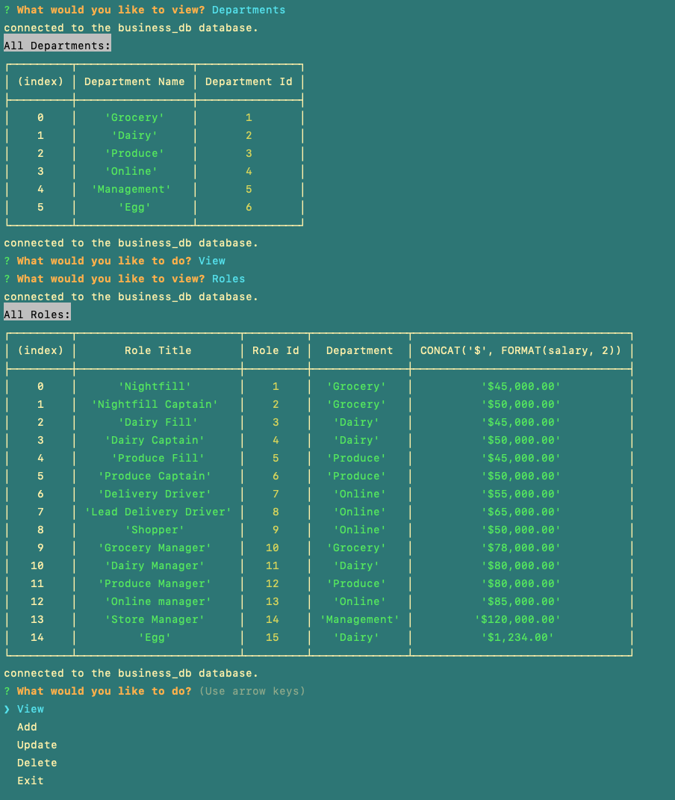

## Business Employee Tracker Tracker by Elibrer 


---


*This application can be used to view all facets of a business database, from viewing all departments/roles/employees to deleting, creating and updating any entry within.*

## Languages used
  [](https://www.mysql.com/)

 [](https://www.npmjs.com/package/inquirer) 

## Links
> - [GitHub Repository](https://github.com/elibrer/employee-tracker)
> 
> - [Video Walkthrough](https://drive.google.com/file/d/13FvRrUFCupxbSm_hGbaXSBURCUYdD74X/view?usp=share_link)

## Contributors
> Elijah Brereton @[GitHub](https://github.com/elibrer)


## Table of Contents
- [Description](#description)
- [Installation](#installation)
- [Features](#features)
- [Documentation](#documentation)
- [Application Preview](#full-preview)
- [License](#license)
- [Tests](#tests)
- [Questions](#questions)

## Description
For when the user needs to have a database to manage their employees within a business. This database contains all departments, roles, salaries, and related managers to each of the employees. This allows the user to maintain and control exactly what each employee earns, which department they belong to, what their role within the deparment is, and who manages them.

## Installation
Ensure `mysql` has been installed on your system. For instructions on how to do this please visit: [dev.mysql.com](https://dev.mysql.com/doc/mysql-installation-excerpt/5.7/en/)


Ensure `node.js` has been installed on your system. For instructions on how to do this please visit: [nodejs.org](https://nodejs.org/en). 


Once `node.js` has been installed the user can open the root directory of this application within any console or terminal type program. Check to see if you are in the right location by typing and entering:
```
ls
```
If the root directory is named `employee-tracker` and there is an `index.js` file within, the user can then proceed. 

Next, the user may type and enter: 
```
npm install
```
to install all required packages found within the `package.json` file. This will install `inquirer.js`, `dotenv`, and `mysql2`. 

Next, the user will need to provide their own `.env` file within the root directory, containing these four parameters. Copy/paste this into the `.env` file and edit the `DB_PASSWORD` parameter to be their own `mysql` password.
```
DB_HOST='localhost'
DB_USER='root'
DB_PASSWORD='UsersMySqlPassword'
DB_NAME='business_db'
```

If all of the required packages have been successfully installed and the `.env` file is in place, the user may proceed by starting up mysql within their terminal (still set to the root directory) and typing and entering:
```
mysql -u root -p
```
in which the user must provide their `mysql` password. 

The user can then proceed by typing and entering:
```
source ./db/schema.sql
```
to create the `business_db` database. (WARNING - ensure any previous `business_db` databases are backed up or renamed, as this will delete all previous entries).

If previous steps have been completed succesfully, the user may start the application by typing and entering:
```
node index.js
```
or
```
npm run start
```
into the console. This will run the script in which the user can use the application to view, create, update, or delete departments, roles, and employees from their system. 

---

If there are any issues with running the `npm install` command, please follow these instructions to manually install all packages:

The user will need to ensure the `inquirer` (version 8.2.4) command line interface package is installed. This can be done by typing and entering:
```
npm i inquirer@8.2.4
```
Next, install the `mysql2` package:
```
npm i mysql2
```
Finally install the `dotenv` package:
```
npm i dotenv
```
## Features
- Once the terminal directory is set to the root directory of the application, the user may begin by entering 
```
node index.js
```
or
```
npm run start
```

- Once the script begins, the user is presented with five options in a main menu style. The options are `View`, `Add`, `Update`, `Delete`, and `Exit`.
- When the user selects the `View` option, the console will present seven more options to choose from: `Departments`, `Roles`, `Employees`, `Managers`, `Employees by manager`, `Combined department salaries`, and `Back`.
- When the user selects the `Departments` option, a table featuring every department and department_id is shown.
- When the user selects the `Roles` option, a table featuring every role, role_id, and salary is shown.
- When the user selects the `Employees` option, a table featuring every employee, employee_id, role, role_id, salary, department, and department_id is shown.
- When the user selects the `Managers` option, a table featuring every manager and manager_id is shown.
- When the user selects the `Employees by manager` option, they are given a list of managers to choose from. Once they select a manager, a table featuring every employee under that manager is shown.
- When the user selects the `Combined department salaries` option, they are given a list of departments to choose from. Once they select a department, the total combined salaries of every employee in that department is shown.
- When the user selects the `Add` option, the console will present four more options to choose from: `Department`, `Role`, `Employee`, and `Back`.
- When the user selects the `Department` option, they are prompted to enter the name of the department they would like to add, then taken back to the main menu and a message confirming the department that was added is shown.
- When the user selects the `Role` option, they are prompted to enter the title of the role they would like to add, the salary of the role they would like to add, and to select the department that the role they are adding belongs to. Then they are taken back to the main menu and a message confirming the role that was added is shown.
- When the user selects the `Employee` option, they are prompted to enter the first name and last name of the employee they would like to add, to select the role that the employee they are adding belongs to, and to select the manager that the employee they are adding reports to. Then they are taken back to the main menu and a message confirming the employee that was added is shown.
- When the user selects the `Update` option, the console will present three more options to choose from: `Employee role`, `Employee manager`, and `Back`.
- When the user selects the `Employee role` option, a table featuring every employee is shown. Then they are prompted to select the employee whose role they would like to update, to select the role that the employee they are updating belongs to, and then taken back to the main menu and a message confirming the employee role that was updated is shown.
- When the user selects the `Employee manager` option, a table featuring every employee is shown. Then they are prompted to select the employee whose manager they would like to update, to select the manager that the employee they are updating reports to, and then taken back to the main menu and a message confirming the employee manager that was updated is shown.
- When the user selects the `Delete` option, the console will present four more options to choose from: `Department`, `Role`, `Employee`, and `Back`.
- When the user selects the `Department` option, a table featuring every department and department_id is shown, and then the user is prompted to enter the ID of the department they would like to delete. Once the user enters the ID and confirms the deletion, the department and all of its associated roles and employees are deleted from the database, and a message confirming the deletion is shown.
- When the user selects the `Role` option, a table featuring every role and role_id is shown, and then the user is prompted to enter the ID of the role they would like to delete. Once the user enters the ID and confirms the deletion, the role and all of its associated employees are deleted from the database, and a message confirming the deletion is shown.
- When the user selects the `Employee` option, a table featuring every employee and employee_id is shown, and then the user is prompted to enter the ID of the employee they would like to delete. Once the user enters the ID and confirms the deletion, the employee is deleted from the database, and a message confirming the deletion is shown.
- When the user selects the `Back` option in any of the sub-menus, they are taken back to the main menu.
- When the user selects the Exit option, the script will terminate.
- If the user enters an invalid id relating to a table (eg, manager_id when referring to the managers table), the script will tell the user that they entered an invalid id and the prompts will start again. 
- If the user tries to delete a role that has employees still within, an error will occur and tell the user to first remove all employees attached to that role. 
- If the user tries to delete a department with employees still within roles attached to said department, and error will occur and tell the user to first remove all employees attached to that role within the department.


## Documentation
No documentation provided.
## Application Preview
### `Preview of application in console.`



## License
[Licensed under the MIT license.](https://opensource.org/licenses/MIT)

## Tests
To test, seed the database with included seeds.sql file by starting up mysql within their terminal (still set to the root directory) and typing and entering:
```
mysql -u root -p
```
in which the user must provide their `mysql` password. 

Then, they can enter:
```
source ./db/seeds.sql
```
to populate the database with names and data to show functionality of the application.

The user may then operate the application how they please, and if any errors are found please do not hesitate to contact me at the email provided below.

The user can then proceed by typing and entering:
## Questions
For questions and enquiries, please contact me at: 
[eli.brer@gmail.com](eli.brer@gmail.com)